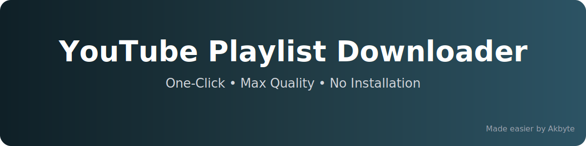

<div align="center">

# 🎬 YouTube Playlist Downloader (Easy Folder Setup)

🚀 **Download full YouTube playlists in maximum quality with one click**  
No Python • No installation • Just click & paste


</div>

---

## 📌 Overview

This project provides a **ready-to-use Windows folder** that makes downloading YouTube playlists **extremely easy**.

You **do not** need:
- Python ❌
- Command-line knowledge ❌
- Installation ❌

Just:
➡️ **Double-click the BAT file**  
➡️ **Paste playlist link**  
➡️ **Done**

---

## 📂 Folder Structure

Keep **all files in the same folder**:

```
YT-Playlist-Downloader/
│
├── Downloader.bat
├── yt-dlp.exe
├── ffmpeg.exe
├── ffprobe.exe
├── banner-dark.svg
└── Downloads/
```

---

## ▶️ How to Use

| Step | Action |
|------|--------|
| 1️⃣ | Download or clone this repository |
| 2️⃣ | Open the folder |
| 3️⃣ | **Double-click `Downloader.bat`** |
| 4️⃣ | Paste your **YouTube playlist URL** |
| 5️⃣ | Press **Enter** |
| 6️⃣ | Wait for download to finish |

📁 Output location:
```
Downloads/Playlist Name/
```

---
## 📦 FFmpeg Notice

Due to GitHub file size limits, FFmpeg is **not included** in this repository.

The downloader will **automatically download FFmpeg on first run** if it is not found.
No manual setup is required.

## 🎥 Download Features

| Feature | Supported |
|-------|-----------|
| Best video quality | ✅ |
| Best audio quality | ✅ |
| Auto merge (video + audio) | ✅ |
| Playlist order preserved | ✅ |
| MP4 format | ✅ |
| Folder-only output | ✅ |

---

## ⚠️ Important Notes

- ❌ **Do NOT double-click `yt-dlp.exe`**
- ✅ Always run **`Downloader.bat`**
- 🔓 Playlist must be **public**
- 💾 Ensure enough disk space
- 🛡️ Antivirus warnings may appear (false positives for CLI tools)

---

## 🧰 Tools Used

| Tool | Purpose |
|------|--------|
| **yt-dlp** | Downloads YouTube videos & playlists |
| **FFmpeg** | Merges video and audio streams |

These tools are **not owned by this project**.

---

## ⚖️ Disclaimer

This project:
- ❌ Does **not** own YouTube content
- ❌ Does **not** own yt-dlp or FFmpeg
- ✅ Only provides an **easy-to-use wrapper**

You are responsible for following:
- YouTube’s Terms of Service  
- Local copyright laws  

Use for **educational and personal purposes only**.

---

## ✨ Credit & Watermark

> 🔖 **Made easier by Akbyte**  
> 👤 Owner / Maintainer: **Akbyte**

I do **not claim ownership** of yt-dlp or FFmpeg.  
I only simplified the setup so people can use it easily.

---

## ⭐ Support

If this project helped you:
- ⭐ Star the repository
- 🐞 Report bugs via Issues
- 💡 Suggest improvements

---

<div align="center">

**Happy Downloading 🎉**  
**– Akbyte**

</div>
